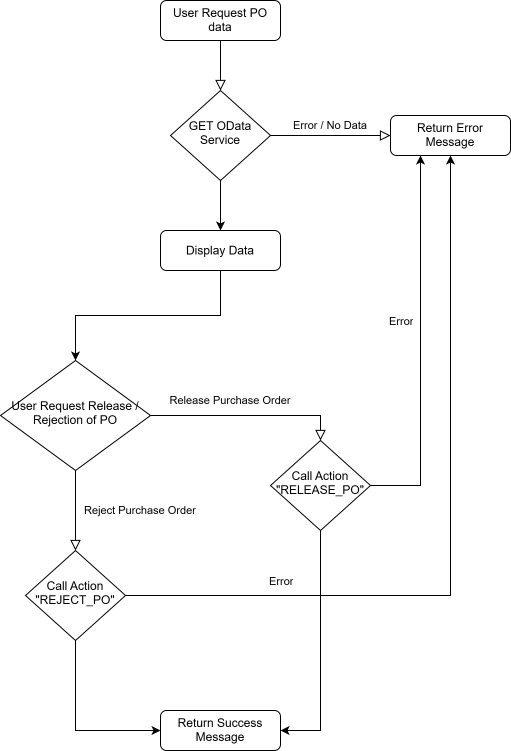

# Chatbot Integration

## General Flow for Chatbot
    - User requests the relevant Purchase Order Information.
    - Chatbot will use function call to call a GET API Request to SAP Back-End.
    - Called OData Service will return a list of relevant Purchase Orders.
    - User can request the Release / Rejection of a Purchase Order.
    - Chatbot will use funciton all to call a POST API Request to SAP Back-End.
    - Called OData Service performs the requested Action and return results (Success or Failure).

## Contributing
State if you are open to contributions and what your requirements are for accepting them.

For people who want to make changes to your project, it's helpful to have some documentation on how to get started. Perhaps there is a script that they should run or some environment variables that they need to set. Make these steps explicit. These instructions could also be useful to your future self.

You can also document commands to lint the code or run tests. These steps help to ensure high code quality and reduce the likelihood that the changes inadvertently break something. Having instructions for running tests is especially helpful if it requires external setup, such as starting a Selenium server for testing in a browser.

## Authors and acknowledgment
Show your appreciation to those who have contributed to the project.

## License
For open source projects, say how it is licensed.

## Project status
If you have run out of energy or time for your project, put a note at the top of the README saying that development has slowed down or stopped completely. Someone may choose to fork your project or volunteer to step in as a maintainer or owner, allowing your project to keep going. You can also make an explicit request for maintainers.
